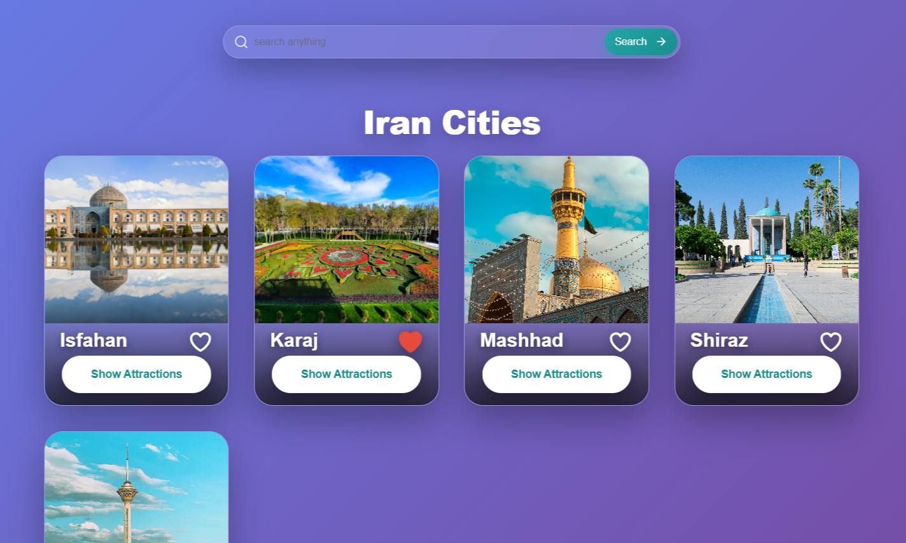
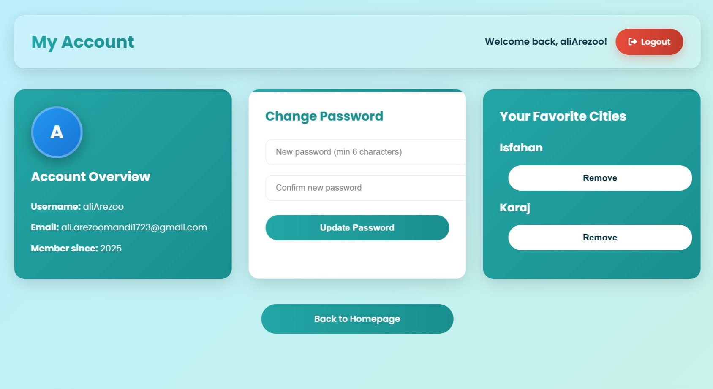

# IranWander — CS50x 2025 Final Project
A scalable, full-stack exploration platform for Iranian cities & attractions

## Video demo

[**🔗watch inYoutube**](https://youtu.be/UtQ0GimeB4g)

## Live Demo

ToDo

## 📌 Description

IranWander is a full-stack web application designed as a high-quality CS50 final project, but intentionally structured so it can grow into a long-term, production-ready project. The application allows users to browse Iranian cities, explore attractions, like their favorite places, manage a user profile, and reset their passwords via email.

The architecture follows real industry standards: modular blueprints, Flask-Login authentication, relational SQL modeling, and a lightweight frontend enhanced progressively with JavaScript.

The goal of this project was not only to satisfy the CS50 final requirements, but to create a maintainable, expandable foundation that a real team could continue developing beyond the course.

## Shots

**HomePage**

  

**Cities** 

  

**User panel** 

  

## Technology Stack & Rationale

| Tech                                   | Why Chosen |
|----------------------------------------| --- |
| Flask                                  | Lightweight, explicit, perfect for learning and real-world small-to-medium apps |
| Flask-SQLAlchemy                       | Expressive ORM with clear relationship modeling (many-to-many favorites) |
| SQLite (dev) → PostgreSQL (prod-ready) | Zero-config for demo, easy migration path |
| Flask-Login                            | Industry-standard session management |
| Flask-Mail + itsdangerous              | Secure password reset without storing tokens in DB |
| Jinja2 + Vanilla JS                    | SEO-friendly, accessible, fast initial load, progressive enhancement |
| Glassmorphism & animating UI           | Modern, beautiful, and fully custom — no heavy frameworks |

## 📁 Project Architecture

The project follows a clean, layered structure:

* iranwander/
* │── routes/
* │     ├── main.py
* │     ├── city.py
* │     ├── auth.py
* │     ├── api.py
* │     └── user.py
* │── templates/
* │── static/
* │── models.py
* │── config.py
* │── run.py
* │── migrations/
* │── iranwander.db

# ✔️ Blueprint-based Routing

Each app feature is isolated into its own blueprint:

`main_bp: home page & landing routes

city_bp: city pages, attraction views

auth_bp: register/login/logout & email reset system

api_bp: JSON endpoints (like/unlike actions)

user_bp: user dashboard & profile`

Blue­prints keep the project highly modular. Adding new features—like comments, bookmarks, or an admin dashboard—does not require touching the core app. In __init__.py, the app simply registers each module:

* app.register_blueprint(main_bp)
* app.register_blueprint(city_bp)
* app.register_blueprint(auth_bp)
* app.register_blueprint(api_bp)
* app.register_blueprint(user_bp)

_This separation is one of the reasons IranWander is extendable far beyond a CS50 academic project._

## 🗄️ Database & Models

The data layer uses SQLAlchemy with a relational design:

**user**

id, username, email, password_hash

created_at

Unique constraints for username & email

**city**

id, name, description, image

**place**

id, name, description, city_id

location, hours, price

gallery_images (comma-separated JSON-like text)

**favorites (many-to-many)**

user_id, city_id

This table powers the “liked cities” feature inside the user dashboard.

## ✔️ Password Security

Users’ passwords are never stored in plaintext:

set_password() → generate_password_hash()
check_password() → check_password_hash()

This follows modern PBKDF2 hashing standards.

## 🔐 Authentication & Sessions

Authentication is implemented using Flask-Login, an industry-standard extension for session-based login systems.

login_user(user) stores the user in the session

current_user provides the active user

Protected routes use:

`@login_required
`

this app does not rely on manual session dictionaries. Instead, LoginManager securely manages IDs and session cookies.

This allows precise control over the user lifecycle, redirects, and access checks.

## 📬 Password Reset System

Instead of sending a token and storing it, IranWander automatically generates a secure random password:

`_User submits their email

Server generates a 12-character password

Password is hashed & saved

Email is sent with beautifully formatted HTML

If email fails, the password is still changed and shown via flash message

This approach ensures users always regain access—even if SMTP fails.`_

## 🌐 JSON API — Likes / Favorites

The /api/like endpoint lets users like or unlike a city dynamically:

`if city in current_user.favorites:
    remove...
else:
    add...`

The handler returns clean JSON:

`{ ok: true, action: "liked", city_id: ... }
`

The frontend updates the icon instantly and reflects the change in the user dashboard.

## 🎨 Frontend & UI/UX

The UI is fully responsive, mobile-first, and uses modern design techniques:

**✔️ Lazy-Loading Images**

Improves performance dramatically on mobile devices.

**✔️ Dynamic Avatar Generation**

Every user gets a unique avatar with:

a deterministic color pair

initials derived from username

fast client-side rendering

zero dependencies

**✔️ City Modals & Attraction Cards**

JavaScript dynamically loads content from a local dataset when a user opens a city modal.

**✔️ Animated Like Button**

Small rotating animation when a heart is clicked (CSS transform).

**✔️ True Responsiveness**

Cities, cards, grids, and panels reflow properly across breakpoints.

## ⚙️ Implementation Challenges

Some of the real problems solved during development:

**1. Keeping UI and database likes synchronized**

The UI toggles instantly → backend updates → dashboard stays consistent.

**2. Designing a safe password reset**

Avoiding token storage and ensuring recovery even if email fails.

**3. Structuring blueprints cleanly**

Preventing circular imports and routing conflicts.

**4. Responsive layout issues**

Mobile card scaling and modal overflow needed careful tuning.

**5. Lazy-loaded images & compressed media**

Ensuring page speed stays high without breaking the layout.

## 🚀 Future Enhancements

Full admin panel

User-generated reviews

Commenting system

Full gallery per city

Real deployment on Linux + Gunicorn + Nginx

API expansion for mobile app development

## Setup & Running

`git clone https://github.com/MahdyarTlb/IranWander.git cd IranWander python -m venv venv source venv/bin/activate # Windows: venv\Scripts\activate pip install -r requirements.txt

### Run!

flask run Open http://127.0.0.1:5000`

## Demo Flow

Visit homepage → explore cities Click any city → view attractions Register/Login → click heart icon to favorite Go to /user/panel → see your favorite places Click "Forgot Password?" → receive reset link Subscribe to newsletter → instant feedback

## 💬 Final Thoughts

IranWander began as a CS50 final project, but the structure, modularity, and professional decisions behind it make it much more than a course assignment. It is a clean, scalable foundation for a real startup-grade product—and a demonstration of mastery over Python, Flask, SQL, and modern web development.

_Made with love in Iran 🤍💚❤️_

_**[Mahdyar Talebi](https://linkedin.com/in/mahdyar-tlb), [Ali Arezoomandi](https://github.com/Ali-Arezoomandi), [Komeil AhanKobi](https://github.com/gitkomeil) — CS50x 2025**_
